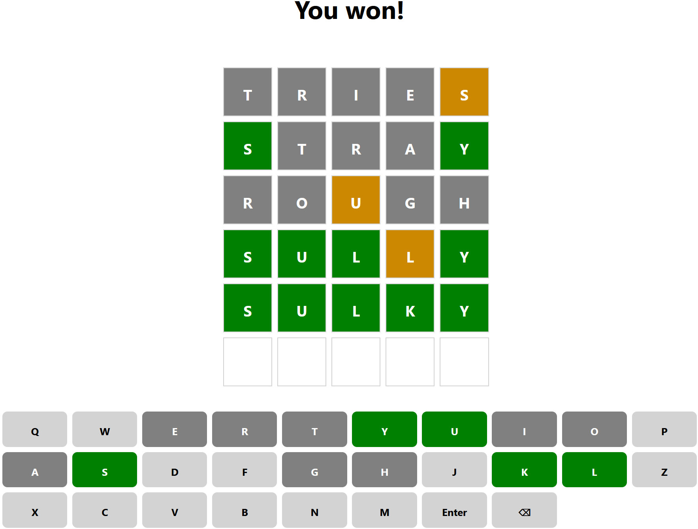

# Wordle clone with React.js

Based on [nytimes.com/wordle](https://www.nytimes.com/wordle).

## Rules

* Guess a 5-letter word with 6 tries.
* Green represents a right word in the right position.
* Yellow(-ish) represents a right word in the wrong position.
* Grey means the word doesn't contain the letter.

## Examples

### Won game

### Word not found animation
